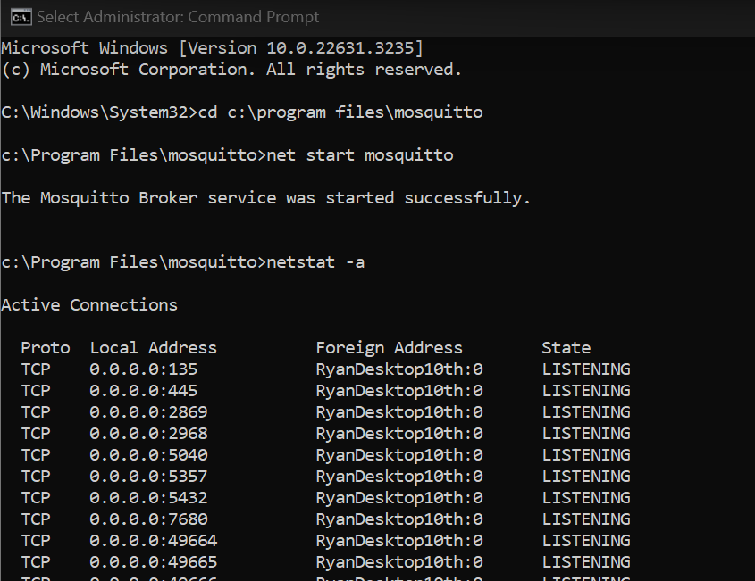
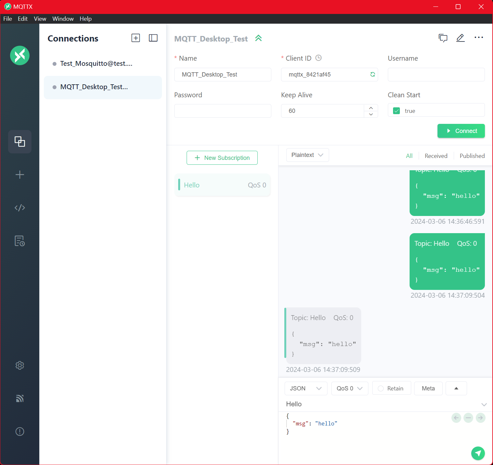

# Mosquitto Commands

## Reference Videos

Install Mosquitto Broker

    https://youtu.be/4ZEPPQLY5o4?si=jbjIvKc8fxVpgW4i

Mosquitto Config Settings and User Authentication

    https://youtu.be/hyJhKWhxAxA?si=qrKiTTuKA_h5hTj2

## Starting Mosquitto

    host: 127.0.0.1
    port: 1883

## Mosquitto Testing

In CMD:

Subscribe:

    c:\Program Files\mosquitto>mosquitto_sub -t test_sensor_data -h localhost

Send:

    c:\Program Files\mosquitto>mosquitto_pub -t test_sensor_data -h localhost -m "temp:100"

In MQTTX:

Settings:

## Mosquitto Config and Authentication

Config File:

    listener 1883
    allow_anonymous false 
    password_file C:\Program Files\mosquitto\passwd

Authentication:

    'C:\Program Files\mosquitto'
    ni passwd
    .\mosquitto_passwd.exe -c .\passwd <user>
