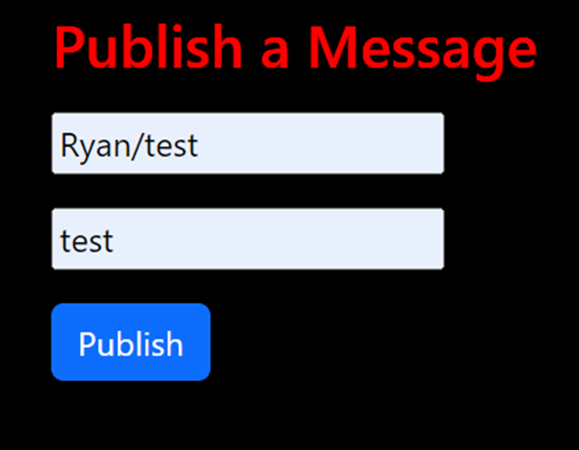

# ENGO 651 Advanced Geospatial Topics Lab 5

## Ryan Janssen

## Overview

This website has a rudimentary layout. It only has one HTML page, which dynamically changes based on the user input. The required functions for the webpage’s JavaScript components are in the header. The body of the HTML file serves as a general template for the JavaScript functions to alter based on the User’s input.

`Youtube Screencast:`

## Launching the Website

a. GitHub Pages:
    Visit `https://soulfulartist35.github.io/ENGO-651-Lab-5/`

b. VS Code:

1. Click on the file “index.html.”
2. Press F5

## Using the Website

a. Connecting to MQTT Broker

1. Type in the desired host, post, and SSL, or use the provided defaults

   

2. Click on “Connect.”

   

3. Allow Location Sharing

   

4. After connecting to the MQTT broker, the connect form will disappear, and the connected options (Share Status, Subscribe, Publish) will appear on the screen. Also your location will appear on the map and follow wherever you go.

   

b. Disconnecting to MQTT Broker

1. Click on “End Connection”

   

2. The to connect form asking for host, port, and SSL will reappear

   

c. Connection Status

A status bar is at the top of the webpage below the main heading. Its primary function is to inform the User of the status of the connection. The console also informs the User about the connection status.

| Status | Meaning |
|----|----|
| Not Connected | MQTT has never connected in instance |
| Connected | Currently connected to MQTT broker |
| Disconnected | User has disconnected session |
| Connection Drop | Lost connection with broker |

d. Subscribing to MQTT Topic

1. Enter the desired MQTT Topic into the subscription form

   

2. Click on “Topic subscribe.”
  
f. Publish an MQTT Message

1. Enter the desired MQTT Topic and desired MQTT message into the “Publish a Message,” form

   

2. Click on “Publish.” If the User has subscribed to the topic, you will receive a message.

   

g. Alternative Method to View Location on Map

1. Subscribe to `ENGO651/Ryan/my_temp` by following instructions in d.

2. Location will appear on the map after approving location sharing

   
   

h. Share User Location

1. Click on “Share my Status”

   

2. Allow location sharing

   
   

i. Map Markers

1. The marker color will indicate the temperature
   | Color | Temperature |
   |---|---|
   | Blue | -40 to 10 |
   | Green | 10.1 to 29.9 |
   | Red | 30 to 60 |

2. Click on the marker to view its exact temperature

    //Change
  
## Using MQTTX (Default Settings)

a. Connect to MQTT Broker

   
  
1. Click on “Add New Connection."
2. Host:

   `wss://`

   `test.mosquitto.org`

3. Port: `8081`

4. Path: `/mqtt`

5. SSL/TLS: `On`

6. SSL Secure:  `off`

7. Certificate: `CA-signed server certificate`

8. Click on “Connect.”

b. Subscribe to MQTT Topic

1. Click on “New Subscription.”

   
   

2. Enter desired topic
3. Qos: `0`

c. Publish an MQTT Message

   

1. QoS `0`
2. Enter desired topic
3. Enter desired message

   
   

## Terms of Use

The User agrees to use only the created website for personal use. This license prohibits altering the created website without explicit consent from the creator. There is no warranty on the software.

## References

1. S. Cope. "JavaScript Websockets." Steve's Internet Guide. `http://www.steves-internet-guide.com/download/            javascript-websockets/` (retrieved Mar 19, 2024)

2. V. Agafonkin, CloudMade and T. Pointhuber, "Leaflet-Color-Markers." n.d.
[Online]. Available: `https://github.com/pointhi/leaflet-color-markers?tab=readme-ov-file`
